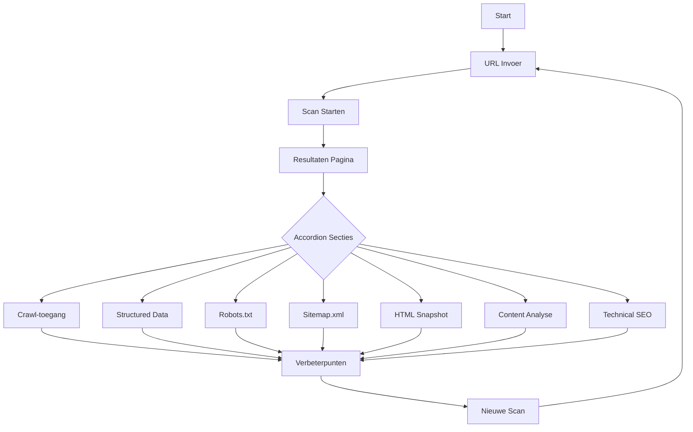
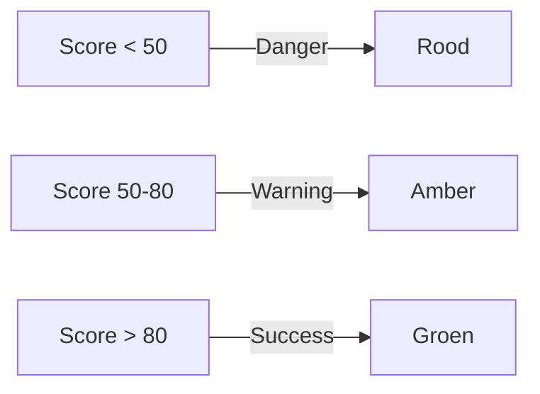
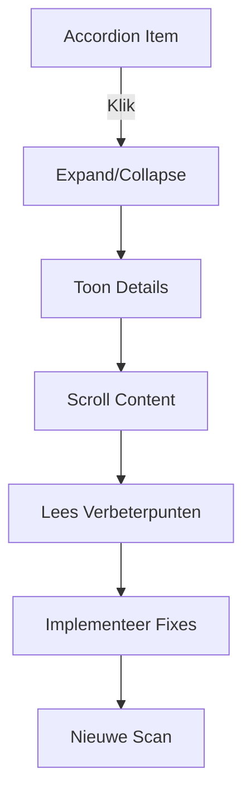

# GeoScanner Userflow

## Hoofdflow

## Detail Flow per Sectie

```mermaid
graph TD
    subgraph "Crawl-toegang"
        F1[Robots.txt Check] --> F2[Sitemap Validatie]
        F2 --> F3[Meta Robots Analyse]
        F3 --> F4[HTTP Status Check]
    end

    subgraph "Structured Data"
        G1[JSON-LD Validatie] --> G2[Open Graph Check]
        G2 --> G3[Schema Types Analyse]
    end

    subgraph "Content Analyse"
        K1[Taal Detectie] --> K2[Keyword Analyse]
        K2 --> K3[Duplicate Content Check]
    end

    subgraph "Technical SEO"
        L1[Performance Metrics] --> L2[Mobile Friendly Check]
        L2 --> L3[Security Analyse]
    end
```

## Status Flow

## Interactie Flow

## Visuele Elementen

- **Status Indicators**

  - Success: Groen badge
  - Warning: Amber badge
  - Danger: Rood badge

- **Layout**

  - Responsive grid system
  - Scrollbare content areas
  - Collapsible sections

- **Interactie**
  - Accordion navigatie
  - Badge status indicators
  - Action buttons
  - Scrollable areas
